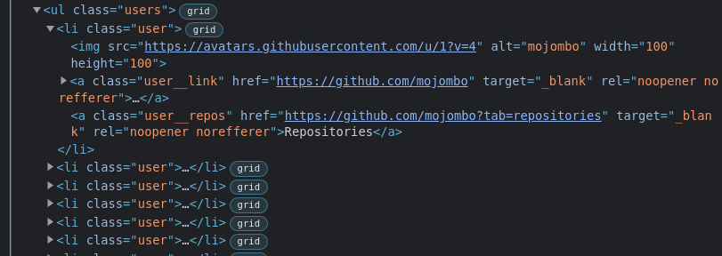

# Задание

Получить список пользователей, и отобразить на странице в соответствии с макетом.

## API

URL: https://api.github.com/users

## Подсказка по стилям

1. Карточка пользователя класс `.user`
2. Аватар пользователя не имеет класса
3. Ссылка на профиль пользователя класс `.user__link`
4. Ссылка на репозитории пользователя класс `.user__repos`

## Пример разметки

